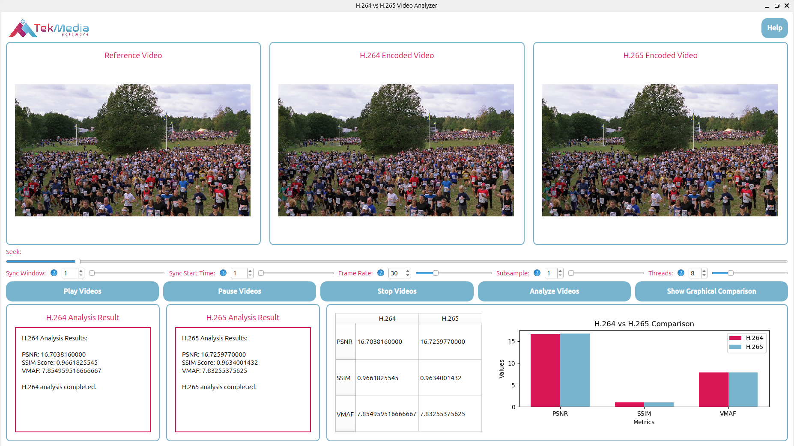
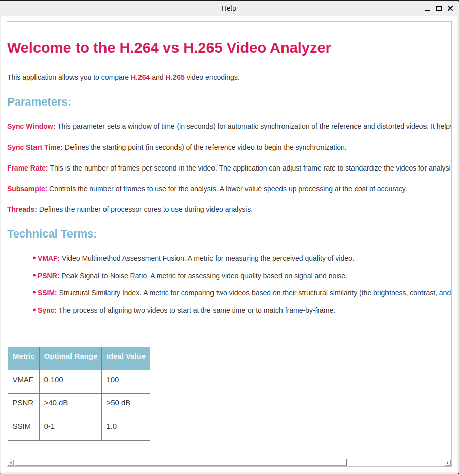

# H.264 vs H.265 Streaming Analyzer

A real-time analysis tool that compares H.264 and H.265 encoded videos against a reference (original) video, enabling users to assess video quality metrics like PSNR, SSIM, and VMAF in a graphical interface.

## Table of Contents

1. Introduction
2. Features
3. Installation
4. Usage
5. Contact
6. Acknowledgements
7. Contributing
8. License

## Introduction

The H.264 vs H.265 Real-Time Streaming Analyzer is designed to help users directly compare the quality of H.264 and H.265 encoded video files. By analyzing metrics such as PSNR, SSIM, and VMAF, the application provides insights into the efficiency and quality differences between the two codecs, allowing users to make informed decisions on codec performance based on their requirements.

### Features

-   Real-Time Video Analysis: Calculates PSNR, SSIM, and VMAF values for H.264 and H.265 encoded videos.
-   Graphical Comparisons: Displays results in a clear, visual format for direct comparison of codec performance.
-   Exportable Results: Save results for future reference and review.

## Installation

### Prerequisites

1. Python >= 3
2. FFmpeg >= 5.0 installed and build with libvmaf 
3. PyQt5 for the user interface
4. Matplotlib for graph visualization

## Steps

1. Clone the repository:

        git clone tekmedia@192.168.0.225:~/git/TekMedia/H.264_vs_H.265_Stream-Analyzer

2. Change directory:

        cd H.264_vs_H.265_Stream-Analyzer

3. Install dependencies:

        pip install -r requirements.txt

4. Verify FFmpeg Installation: Ensure FFmpeg >= 5.0 is installed and correctly configured:

        ffmpeg -version

5. Ensure libvmaf is enabled in the FFmpeg.

## Usage

To start the application, run:

        python3 app.py

The application interface will guide you through loading H.264 and H.265 video files for comparison, and provide graphical and tabulated displays of quality metrics for easy analysis.

## Screenshots

## Contact

For any questions or feedback, please reach out:

- *Awadh Bajpai* - [awabaj@tekmediasoft.net](mailto:awabaj@tekmediasoft.net)
- *Sushanthika Manikandan* - [susman@tekmediasoft.net](mailto:susman@tekmediasoft.net)

## Acknowledgements

- Inspiration: This project was inspired by Eyevinn’s EasyVmaf project (https://github.com/Eyevinn/autovmaf), which provided valuable insights into video quality analysis and metrics evaluation.
- Contributors: Thank you to the open-source community and contributors of relevant libraries and tools that enabled this project.

## Contributing

We welcome contributions! Please see the CONTRIBUTING.md file for detailed guidelines on how to contribute to this project.

## License

This project is licensed under a proprietary license. All rights reserved. You may modify and use this software for personal purposes, but for any production use, reproduction, modification, or distribution, prior written permission from [**TekMedia Software Services**](https://tekmediasoft.com) is required.